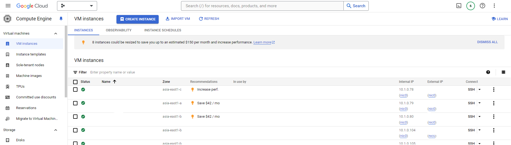
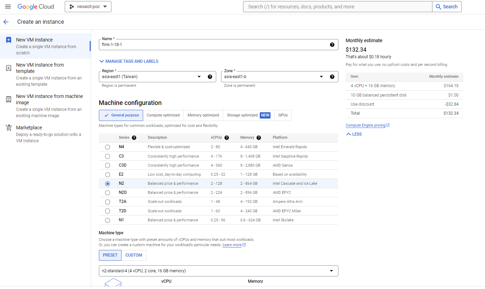
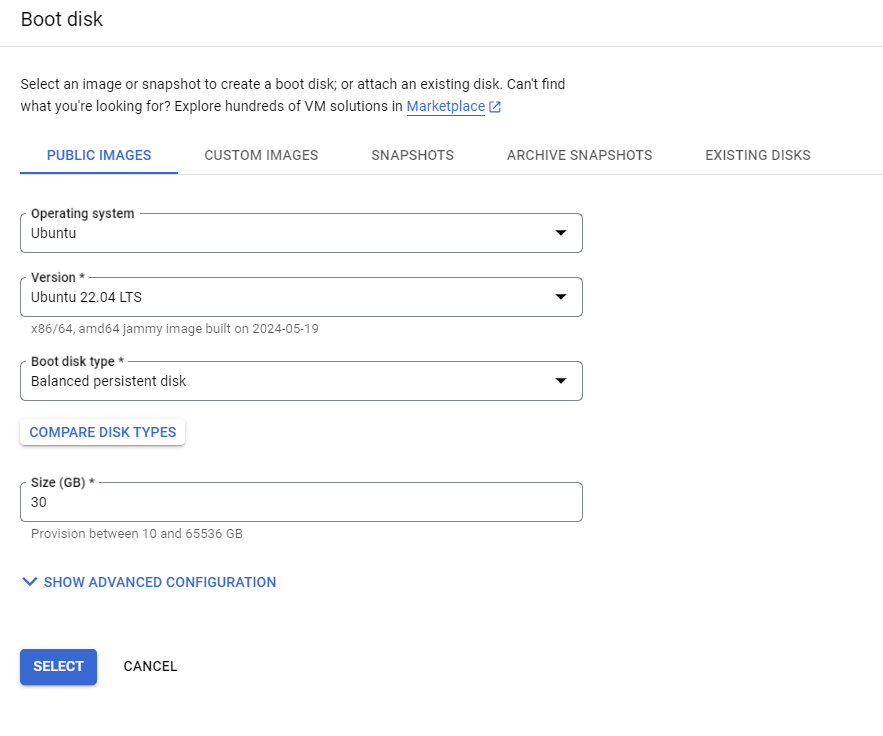
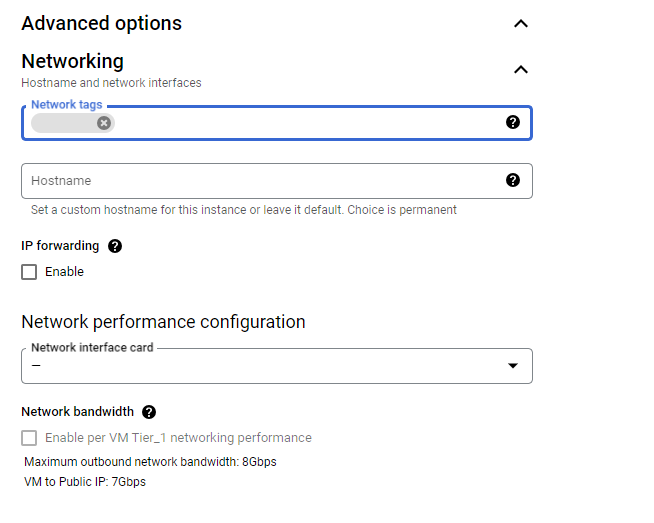
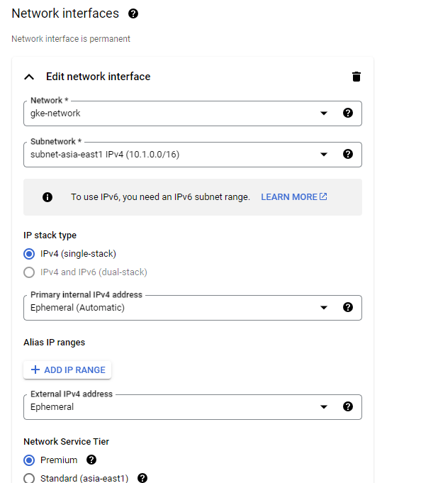

# Setting GCP VM

## GCP VM Instances Page

- click 'CREATE INSTANCES'

## Setting VM Information

- Name: (whatever you like)
- Region: asia-east1(Taiwan), Zone: a/b/c all ok
- Machice: N2, Machice Type: n2-standard-4(4 vCPU, 2 core, 16 GB memory) (choose your own settings)

- Boot Disk Operating system: Ubuntu (will affect subsequent startup instructions)
- Boot Disk Version: Ubuntu 22.04 LTS
- Boot Disk Size: 30 (choose your own settings)

- Networking tags: two tags, one for ssh port 22, one for flink port 8081(whatever you like but same as the firewall target tags set later)

- Networking interface: gke-network
- Networking interface Subnetwork: subnet-asia-east1 IPv4(10.1.0.0/16)

- click 'CREATE'