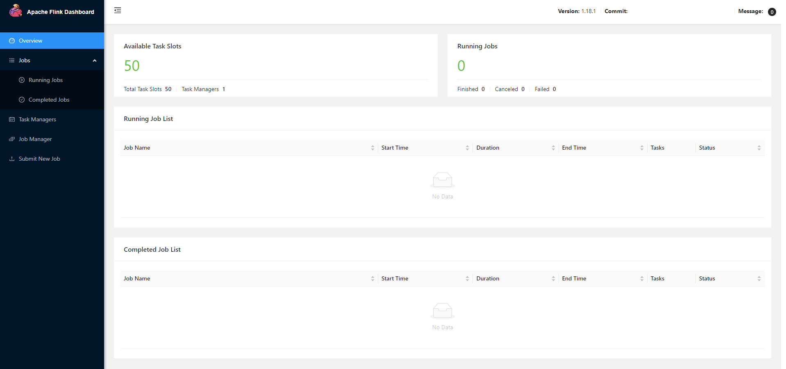

# Deploy Flink In VM


## Install Java
```
sudo apt update
sudo apt install openjdk-11-jdk
```

## Install Flink

- get Flink
```
wget https://downloads.apache.org/flink/flink-1.18.1/flink-1.18.1-bin-scala_2.12.tgz
```

- decompress Flink here
(if you want to decompress Flink elsewhere, the path settings at the bottom must also be modified simultaneously)

```
tar -xvzf flink-1.18.1-bin-scala_2.12.tgz
```

## Setting flink-1.18.1/conf/flink-conf.yaml

- modify yaml(vim uses Esc + :wq to save files)
```
vim flink-1.18.1/conf/flink-conf.yaml
```

- my customized modification template 
```
jobmanager.bind-host: Changed from 'localhost' to '0.0.0.0'.
jobmanager.memory.process.size: Increased from '1600m' to '4096m'.
jobmanager.memory.jvm-metaspace.size: Added with '1024m'.
taskmanager.bind-host: Changed from 'localhost' to '0.0.0.0'.
taskmanager.host: Changed from 'localhost' to '0.0.0.0'.
taskmanager.memory.process.size: Increased from '1728m' to '24576m'.
taskmanager.memory.jvm-metaspace.size: Added with '1024m'.
taskmanager.numberOfTaskSlots: Increased from '1' to '50'.
rest.bind-address: Changed from 'localhost' to '0.0.0.0'.
```

## Setting Path

- modify bashrc(vim uses Esc + :wq to save files)
```
vim ~/.bashrc
```

- adding the following information
```
export FLINK_HOME=~/flink-1.18.1
export PATH=$PATH:$FLINK_HOME/bin
```

- execute ~/.bashrc to enable the settings
```
source ~/.bashrc
```


## Start Flink

```
$FLINK_HOME/bin/start-cluster.sh
```

- open local web browser ${vm External IP address}:8081


## stop Flink
```
$FLINK_HOME/bin/stop-cluster.sh
```
