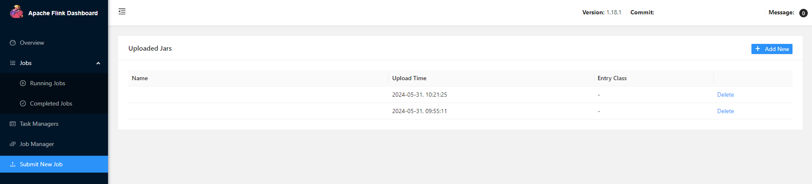
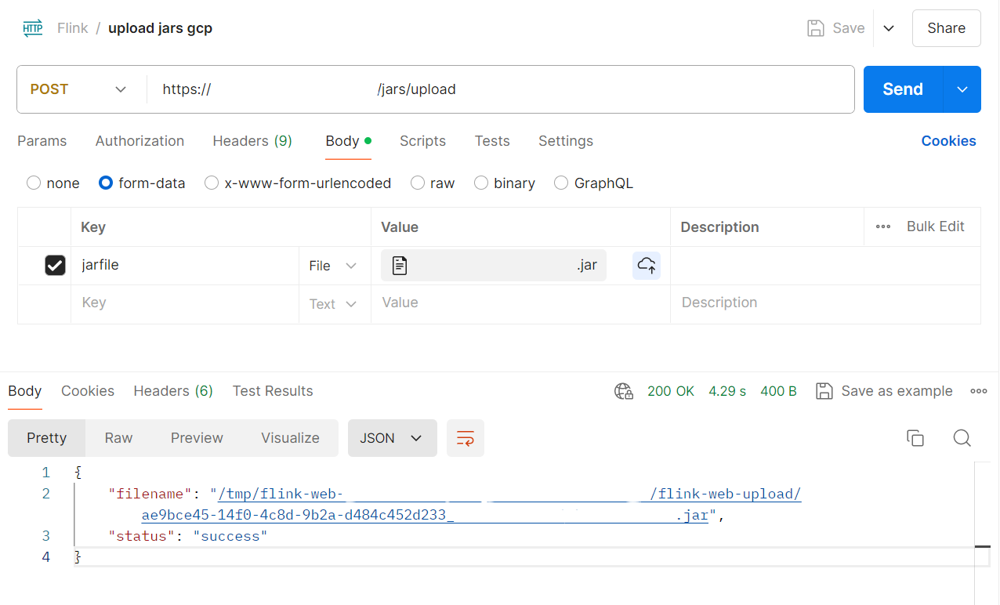
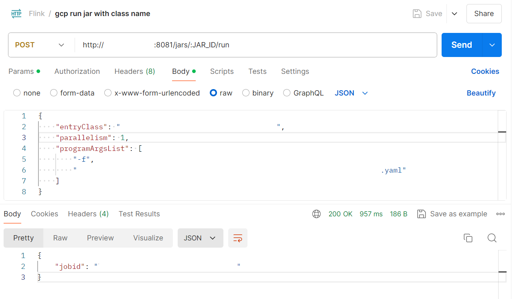
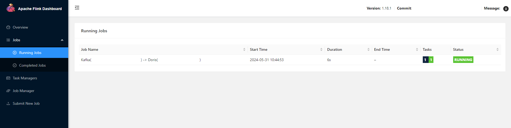

# Upload Jar And Run Job


## Upload Jar


- use UI


- use curl
```
curl -X POST -H "Expect:" -F "jarfile=@"${jar file path}" http://${vm External IP address}:8081/jars/upload
```

- use postman



- use scp into VM, check flink-web- full dictionary name first
```
scp -i ${ssh private key path} ${jar file path} ${metadata-username}@${vm External IP address}:/tmp/flink-web-${full dictionary name}/flink-web-upload
```

- in VM, cd to dictionary and rename
```
cd /tmp/flink-web-${full dictionary name}/flink-web-upload
mv ${jar name} ${uuid_v4}_${jar name}
```


## Run Job

```
JAR_ID: ${uuid_v4}_${jar name}
programArgsList: (if you have setting yaml)
```



## See Running Jobs


